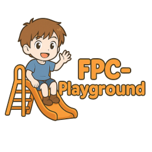
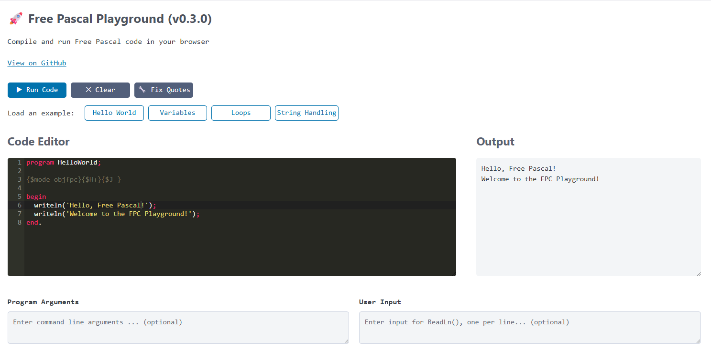

# 🚀 FPC Playground

[](https://opensource.org/licenses/MIT)
[](https://www.freepascal.org/)


[](CHANGELOG.md)


<p align="center">
  <a href="https://fpc-playground-app-mgeib.ondigitalocean.app/">
    
  </a>
</p>


A simple way to run Free Pascal programs in the browser so new developers can learn the language without having to install anything.

Give it a try here: [FPC Playground](https://fpc-playground-app-mgeib.ondigitalocean.app/)

> [!WARNING]
> This project is still a work in progress and will not support all Free Pascal features.



## Table of Contents
- [🚀 FPC Playground](#-fpc-playground)
  - [Table of Contents](#table-of-contents)
  - [🌟 Features](#-features)
  - [✋ Prerequisites](#-prerequisites)
  - [🚀 Quick Start](#-quick-start)
  - [⭐ Feedback](#-feedback)
  - [🏃 Running Locally](#-running-locally)
    - [Using Docker Compose](#using-docker-compose)
  - [🎓 Using the Playground](#-using-the-playground)
    - [**Code Editor**](#code-editor)
    - [**Program Arguments**](#program-arguments)
    - [**User Input**](#user-input)
    - [**Example Usage**](#example-usage)
    - [Without Docker Compose](#without-docker-compose)
      - [Backend](#backend)
      - [Frontend](#frontend)
  - [🧪 Testing with `curl`](#-testing-with-curl)
    - [Test a simple "Hello, World!" program](#test-a-simple-hello-world-program)
  - [🙌 Contributing](#-contributing)
  - [⚖️ License](#️-license)
  - [🙏 Acknowledgments](#-acknowledgments)

## 🌟 Features

- **Web-based Pascal editor** with syntax highlighting
- **Real-time compilation** and execution
- **Program arguments support** - Pass command line arguments to your Pascal programs
- **User input support** - Handle `ReadLn()` statements with dedicated input fields
- **Example programs** to get started quickly
- **Error detection** for common Pascal syntax mistakes
- **Security filtering** to prevent dangerous operations
- **Educational-friendly interface** with clear separation of code, input, and output

## 🔒 Security Features

- **Smart Keyword Detection**: Advanced pattern matching prevents dangerous operations while allowing legitimate code
- **False Positive Prevention**: Names like "Asher" and "Ashley" work perfectly - no more frustrating blocks!
- **Multi-layered Validation**: Character encoding, complexity checks, and comprehensive threat detection
- **Word Boundary Matching**: Uses regex word boundaries (`\b`) for precise keyword detection
- **Context-Aware Shell Detection**: Shell commands only blocked in dangerous contexts (e.g., `sh -c`, `/bin/sh`)
- **Educational Focus**: Secure enough for learning environments, flexible enough for creativity

## ✋ Prerequisites

Make sure you have Docker installed. You can download it from [Docker's official site](https://www.docker.com/get-started).

## 🚀 Quick Start
1. Clone the repository: `git clone https://github.com/ikelaiah/fpc-playground.git`
2. Run Docker Compose: `docker-compose up`
3. Access the frontend at `http://localhost:8080` and start coding!

## ⭐ Feedback
We value your feedback! If you enjoy using FPC Playground, please star the repository and share your thoughts.

## 🏃 Running Locally

### Using Docker Compose

To simplify setup, you can use Docker Compose to run both the backend and frontend services:

1. Clone the repository:

```bash
git clone https://github.com/ikelaiah/fpc-playground.git
```

2. Navigate to the project directory:

```bash
cd fpc-playground
```

3. Run Docker Compose:

```bash
docker-compose up
```

4. Access the frontend at `http://localhost:8080` and the backend at `http://localhost:5000`.

## 🎓 Using the Playground

The FPC Playground provides an intuitive interface for learning Pascal programming:

### **Code Editor**
- Write your Pascal code with syntax highlighting
- Use the example buttons to load pre-written programs
- Fix quotes automatically for Pascal compatibility

### **Program Arguments**
- Use the "Program Arguments" textarea to pass command line arguments to your program
- Separate multiple arguments with spaces
- Example: `arg1 arg2 arg3`

### **User Input**
- Use the "User Input" textarea to provide input for `ReadLn()` statements
- Enter each input value on a separate line
- The program will read these values in order when it encounters `ReadLn()`

### **Example Usage**
```pascal
program TestInput;
var
    name: string;
    age: integer;
begin
    writeln('What is your name?');
    readln(name);
    writeln('How old are you?');
    readln(age);
    writeln('Hello ', name, ', you are ', age, ' years old!');
end.
```

For this program, enter in the User Input field:
```
John
25
```

The output will be:
```
What is your name?
How old are you?
Hello John, you are 25 years old!
```

### Without Docker Compose

#### Backend

To run the backend manually without Docker Compose, follow these steps:

1. Clone the repository:

```bash
git clone https://github.com/ikelaiah/fpc-playground.git
```

2. Navigate to the `backend` directory:

```bash
cd fpc-playground/backend
```

3. Build the Docker image:

```bash
docker build -t fpc-playground-backend .
```

4. Run the Docker container:

```bash
docker run -p 5000:5000 fpc-playground-backend
```

#### Frontend

The frontend is a simple HTML page that interacts with the backend API using JavaScript.

To run the frontend manually, you can simply open the `index.html` file in your web browser. It will automatically connect to the backend running on `http://localhost:5000`.

## 🧪 Testing with `curl`

Run the following commands to test the backend using `curl`:

```bash
cd backend
docker build -t fpc-playground-backend .
docker run -p 5000:5000 fpc-playground-backend
```

### Test a simple "Hello, World!" program

**Note**: The API requires base64 encoded Pascal code, arguments, and input.

```bash
# Create test payload with base64 encoded Pascal code
echo '{"code":"'$(echo "program HelloWorld; begin writeln('Hello, World!'); end." | base64 -w 0)'","args":"","input":""}' > test.json
curl -X POST http://localhost:5000/run -H "Content-Type: application/json" -d @test.json
```

**Alternative method using a helper script:**
```bash
# Create a simple test script
cat > test_api.sh << 'EOF'
#!/bin/bash
CODE="program HelloWorld; begin writeln('Hello, World!'); end."
ENCODED_CODE=$(echo -n "$CODE" | base64 -w 0)
echo '{"code":"'$ENCODED_CODE'","args":"","input":""}' | curl -X POST http://localhost:5000/run -H "Content-Type: application/json" -d @-
EOF
chmod +x test_api.sh
./test_api.sh
```

## ⚠️ Current Limitations

- **Code size**: Maximum 16KB per program
- **Output size**: Limited to 48KB to prevent abuse
- **Rate limiting**: 150 requests per hour, 10 per minute
- **Pascal features**: Not all Free Pascal features supported (work in progress)
- **Complex structures**: Limited nested structures (max 20 `begin` statements, 100 parentheses, 50 brackets)
- **Character encoding**: Only standard ASCII characters (32-126) plus newlines, carriage returns, and tabs

## 🔧 Troubleshooting

### Common Issues
- **"Code contains restricted keyword"**: Check for Pascal reserved words in variable names or use different names
- **"Code structure too complex"**: Simplify nested structures or break code into smaller functions
- **Connection refused**: Ensure Docker containers are running on correct ports (8080 for frontend, 5000 for backend)
- **Compilation errors**: Verify Pascal syntax - the playground uses Free Pascal 3.2.2+
- **"Code contains invalid characters"**: Use only standard ASCII characters in your code

### Getting Help
- Check our [Issues page](https://github.com/ikelaiah/fpc-playground/issues) for known problems
- Join the [Free Pascal Discord](https://discord.com/channels/570025060312547359/570091337173696513) for community support
- Review the [CHANGELOG.md](CHANGELOG.md) for recent updates and fixes

## 🙌 Contributing
We welcome contributions! To contribute:
1. Fork the repository.
2. Create a new branch (`git checkout -b feature-branch`).
3. Make your changes and commit them (`git commit -m "Add feature"`).
4. Push to your branch (`git push origin feature-branch`).
5. Open a pull request.

## ⚖️ License

MIT License - see [LICENSE](LICENSE.md) file for details.

## 🙏 Acknowledgments

- [Free Pascal Dev Team](https://www.freepascal.org/) for the Pascal compiler
- [Lazarus IDE Team](https://www.lazarus-ide.org/) for such an amazing IDE
- The kind and helpful individuals on various online platforms such as:
    - [Unofficial Free Pascal Discord server](https://discord.com/channels/570025060312547359/570091337173696513)
    - [Free Pascal & Lazarus forum](https://forum.lazarus.freepascal.org/index.php)
    - [Tweaking4All Delphi, Lazarus, Free Pascal forum](https://www.tweaking4all.com/forum/delphi-lazarus-free-pascal/)
    - [Laz Planet - Blogspot](https://lazplanet.blogspot.com/) / [Laz Planet - GitLab](https://lazplanet.gitlab.io/)
    - [Delphi Basics](https://www.delphibasics.co.uk/index.html)
- All contributors who have helped improve this project